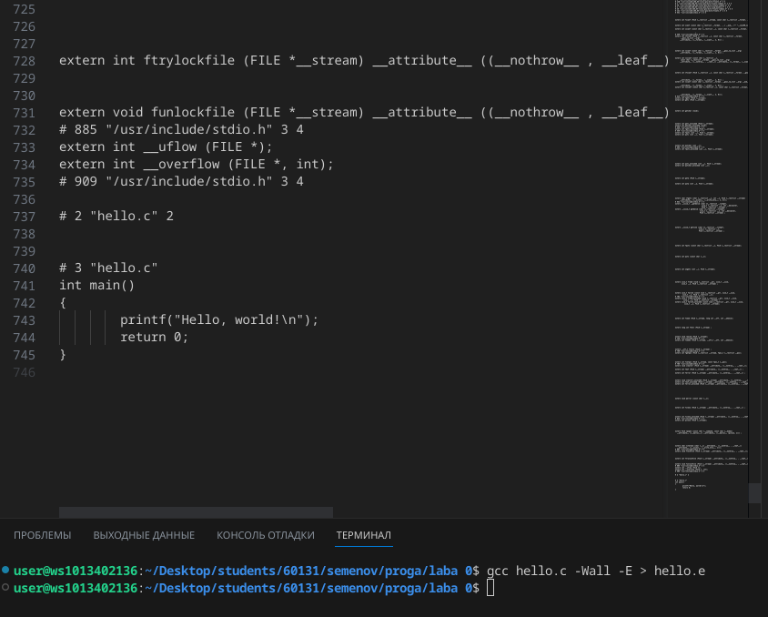

# proga
prog labs
# отчёт в Markdown
## задание
Сложность:
    Rare

1 Создайте репозиторий для дисциплины на GitHub.

2 Склонируйте его себе на ПК.

3 Напишите свою первую программу.

4 Скомпилируйте и запустите её.

5 Получите по отдельности результаты каждого этапа компиляции.

6 Напишите отчёт в README.md. Отчёт должен содержать:

6.1 Задание

6.2 Описание проделанной работы

6.3 Консольные команды

6.4 Скриншоты результатов

6.5 Ссылки на используемые материалы

7 Сделайте коммит и пуш.

8 Добавьте для себя в отчёт шпаргалку по работе с git.

## ход работы
### 1. Создайте репозиторий для дисциплины на GitHub
ссылка на репризиторий:https://github.com/Yoriichi2222/proga
### 2.Склонируйте его себе на ПК 
```shell
get clone https://github.com/Yoriichi2222/proga.git
```

## изначальный код на С
### 3. Напишите свою первую программу
```c
    #include <stdio.h>

int main()
{
        printf("Hello, world!\n");
        return 0;
}
```
### 4. Скомпилируйте и запустите её


### 5. Получите по отдельности результаты каждого этапа компиляции
## препроцессор



## Компилятор

## Объектные файлы 

## 7. Сделайте коммит и пуш


 ## 8 Добавьте для себя в отчёт шпаргалку по работе с git
 ```shell
 git clone
 git add .
 git commit
 git push
 ```
 ## список использованных источников:
1.https://doka.guide/tools/markdown/

2.https://github.com/still-coding/report_demo/blob/main/README.md?plain=1